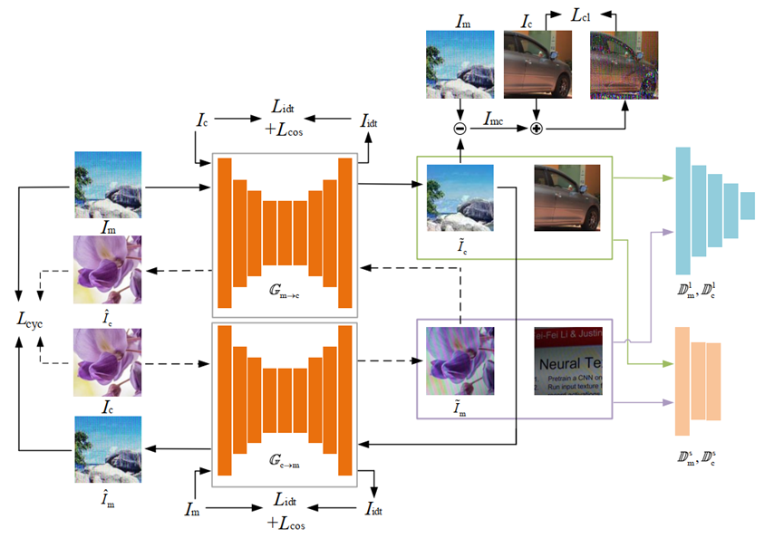

# pytorch-MRGAN-master
Code of the moire removal method "Unsupervised Moire Patterns Removal for Recaptured Screen Images"

## Results


## Framework


## Prerequisites
- Linux or macOS
- Python 3
- CPU or NVIDIA GPU + CUDA CuDNN

## Getting Started
### Installation

- Clone this repo:
```bash
git clone https://github.com/JerryLeolfl/pytorch-MRGAN-master.git
cd pytorch-MRGAN-master
```

- Install [PyTorch](http://pytorch.org) and 0.4+ and other dependencies (e.g., torchvision, [visdom](https://github.com/facebookresearch/visdom) and [dominate](https://github.com/Knio/dominate)).

### train/test
- Get the whole [dataset](https://pan.baidu.com/s/1_4IeSwDkJXetNjbkCcCr3w)(key:8wm4).
- To view training results and loss plots, run `python -m visdom.server` and click the URL http://localhost:8097.
- Train a model:
```bash
python train.py --dataroot ./path/to/trainset --name moire_cyclegan --model cycle_gan
```
To see more intermediate results, check out `./checkpoints/moire_cyclegan/web/index.html`.
- Test the model:
```
python test.py --dataroot ./path/to/testset --name moire_cyclegan --model cycle_gan
```
- The test results will be saved to a html file here: `./results/moire_cyclegan/latest_test/index.html`.


## Citation
If you use this code for your research, please cite our papers.
```
@inproceedings{MRGAN2021yue,
  title={Unsupervised Moir\'e Pattern Removal for Recaptured Screen Images},
  author={Huanjing Yue, Fanglong Liu and Jingyu Yang},
  year={2021}
}
```


## Acknowledgments
Our code is inspired by [pytorch-CycleGAN-and-pix2pix](https://github.com/junyanz/pytorch-CycleGAN-and-pix2pix).
